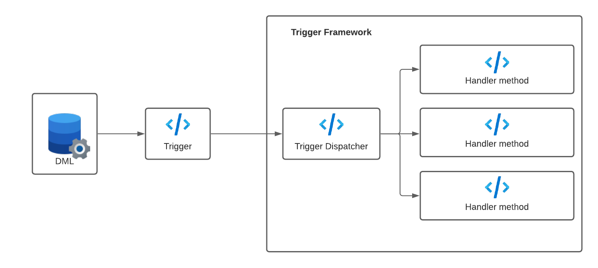

# Trigger Framework

### Apex Triggers
> A **trigger** is Apex code that executes before or after the following types of operations:
- insert
- update
- delete
- merge
- upsert
- undelete

## Trigger Best Practices
1. One Triggeer per Object
2. Logic-less trigger
3. Context-specific handler mehods
4. Bulkifu your code
5. Avoid hardcoding Ids

## Why Use a Trigger Framework
- Help you to conform to best practices
- Make implementing new logic and new context handlers very easy
- Simplify testing and maintenance of your application logic
- Enforces consistent implementation of Trigger logic
- Implement tools, utilities, and abstractions to make your handler logic as lightweight as possible
- Assure the Order of execution of the code
- Prevent the recursion.
- Ensure that trigger will do not create any issue while working with large datasets

